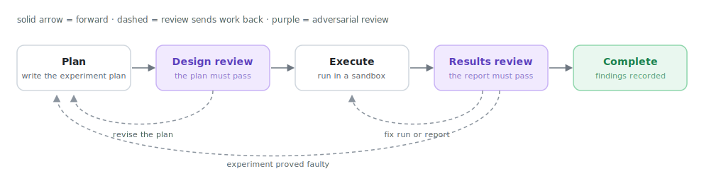
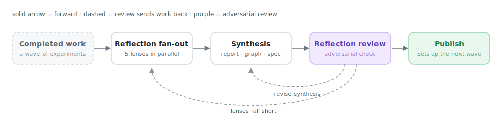
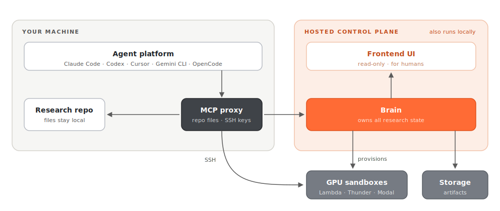

# Merv

Merv is a plugin for agentic coding platforms that helps agents run machine learning research as gated, reviewable experiment workflows.

It is designed to work with Claude Code, Codex, Cursor, Gemini CLI, OpenCode, and other MCP-capable agent platforms. It includes a frontend for humans to observe agent behavior ranging from macro research strategy to experiment execution specifics.

The goal is to give research agents enough structure to plan experiments, execute them, review results, and reflect on the project direction to handle open-ended research problems.

## Experiment-level workflow

<picture>
  <source media="(prefers-color-scheme: dark)" srcset="assets/experiment-workflow-dark.svg">
  
</picture>

Each experiment begins with a generated plan that is adversarially reviewed by another agent. The plan/review loop persists until the reviewer approves the plan. After approval, the agent proceeds to execution. When it is done, it submits a report that is adversarially reviewed by a different agent. The reviewer can send the agent back to execution to fix something in the execution or the report, or it can send it back to the planning stage if the experiment proved faulty.

## Project-level workflow

<picture>
  <source media="(prefers-color-scheme: dark)" srcset="assets/project-workflow-dark.svg">
  
</picture>

After a set of experiments is complete, the plugin drives a project-wide reflection. Five different sub-agents are called, each analyzing the wave's snapshot of all terminal experiments and current claim statuses under a different lens. Their goal is to look for patterns of what works, what does not, and what has not been tried, in order to set up the next phase of experiments. The analysis of the sub-agents is consolidated into a report, logic graph, and change spec. Those artifacts are adversarially reviewed by a different agent for accuracy.

## How the system fits together

<picture>
  <source media="(prefers-color-scheme: dark)" srcset="assets/system-architecture-dark.svg">
  
</picture>

Merv has three main pieces:

- **Agent adapters** connect Claude Code, Codex, Cursor, Gemini CLI, OpenCode, and other agentic clients to the same workflow.
- **Backend** owns the research state: projects, claims, experiments, resources, review gates, reflections, and sandbox orchestration.
- **Frontend** gives humans a visual way to inspect the project: experiments, reviews, artifacts, logic graphs, timelines, and current progress.

By default the plugin connects to the hosted brain; it can also run fully
locally. In either deployment the checkout root, folder-to-project links, and
caller SSH private keys stay on the user's machine. The proxy explicitly sends
project ids, repo-relative resource metadata, and selected submitted bytes; the
brain never opens the checkout directly. Brain management keys remain separate
operational credentials.

## Install

Prerequisites for every client are `python3` 3.11+ and a POSIX shell. No `pip`
install or local brain is required; the proxy talks to the hosted brain by
default. Sandbox SSH and output-pull workflows additionally use the system
OpenSSH client and `rsync`. For Codex, Gemini CLI, and OpenCode, see
[merv/docs/CLIENTS.md](merv/docs/CLIENTS.md).

### Claude Code

```bash
claude plugin marketplace add https://rapidreview.io/marketplace.json
claude plugin install merv@rapidreview
```

Restart Claude Code.

### Cursor

Cursor loads local plugins from a directory, so clone the repo and link the plugin bundle into `~/.cursor/plugins/local`:

```bash
git clone https://github.com/NGXT-Inc/Merv.git ~/Merv
mkdir -p ~/.cursor/plugins/local
ln -sfn ~/Merv/merv ~/.cursor/plugins/local/merv
```

Then enable **merv** on Cursor's Customize page and restart Cursor. (To update later: `git -C ~/Merv pull` and restart.)

### Sign in

The hosted brain requires a RapidReview account. Once per machine:

```bash
merv-client login
```

This opens the browser to complete sign-in; the session is stored locally and
shared by every client on the machine. On a headless box, use
`merv-client login --no-browser` (prints the URL) or
`merv-client login --api-key rr_sk_...`.

### First run

Open the repo you want to research as the workspace, then ask the agent to call
`project(action="current")`. If the folder is unlinked, connect or create the
project with `project(action="connect")`; then call
`workflow.status_and_next()`.

## Migrating from Research Suite (`research-plugin`)

Everything was renamed in v0.0012: the plugin is **merv** (was
`research-plugin`), the marketplace is **rapidreview** (was `research-suite`),
the repo is `NGXT-Inc/Merv` (was `NGXT-Inc/Research-Suite`; old URLs
redirect), the plugin directory inside the repo is `merv/` (was
`research_plugin/`), and the binaries are `merv-mcp` / `merv-client` /
`merv-http` / `merv-control`. The hosted brain also now requires sign-in.

Your data is untouched: projects, folder links, and the machine config in
`~/.research_plugin/` all carry over. `RESEARCH_PLUGIN_*` environment
variables keep their names.

**Claude Code** — the old plugin cannot be updated in place; swap it:

```bash
claude plugin uninstall research-plugin@research-suite
claude plugin marketplace remove research-suite
claude plugin marketplace add https://rapidreview.io/marketplace.json
claude plugin install merv@rapidreview
merv-client login
```

Restart Claude Code. (If you already run `merv@rapidreview`, just
`claude plugin marketplace update rapidreview && claude plugin update merv`.)

**Cursor** — replace the old link with the renamed plugin directory:

```bash
git -C ~/Merv pull   # or wherever your clone lives; old remotes redirect
rm -f ~/.cursor/plugins/local/research-plugin
ln -sfn ~/Merv/merv ~/.cursor/plugins/local/merv
```

Re-enable **merv** on Cursor's Customize page and restart Cursor.

**Codex** — in `~/.codex/config.toml`, replace the old server entry:

```toml
[mcp_servers.merv]
command = "/path/to/Merv/merv/bin/merv-mcp"
```

(The old `research-plugin-mcp` binary no longer exists.) Restart Codex, then
run `merv-client login` if you haven't already.
