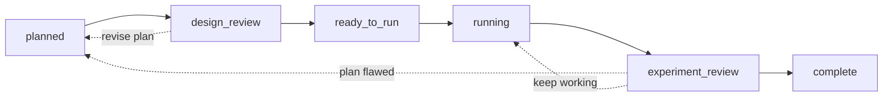
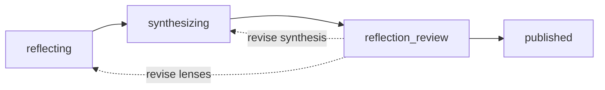

# Merv

Merv gives agentic coding clients (Claude Code, Codex, Cursor, Gemini CLI,
OpenCode, OpenHands, Replit Agent) a shared state machine for machine learning
research: claims, experiments, submitted artifacts, review gates, reflection
waves, and sandboxed execution. A brain running locally or as a hosted service
owns durable research state; every agent client connects directly to the brain's
`POST /mcp` HTTP endpoint, authenticated by a project-scoped key. The brain never receives the checkout root or reads
it directly; gated documents are explicitly uploaded as size-capped
artifacts.

## Get started

```bash
git clone https://github.com/NGXT-Inc/Merv.git ~/Merv
```

That is the whole install — every agent client connects directly to the brain's
`/mcp` HTTP endpoint, so nothing runs on your machine to broker it and there are
no pip packages. Sandbox SSH and agent-run output pulls use the system OpenSSH
client and `rsync`, and presigned artifact and storage transfers use `curl`. The
`merv-client` CLI, `merv-http`, the brain, and backend tests run on Python 3.11+.
Then:

1. Register the plugin in your client — per-client steps in
   [docs/CLIENTS.md](docs/CLIENTS.md).
2. For the hosted brain, export your project key as `MERV_MCP_KEY` — see
   [docs/HOSTED_CLIENT_QUICKSTART.md](docs/HOSTED_CLIENT_QUICKSTART.md).
3. Open your research repo and start a session:

```text
Use Merv. Start with project(action="current"), then workflow.status_and_next.
```

Each client connects straight to the hosted brain's `/mcp` endpoint. The committed
`.mcp.json` uses `type: "http"` and sends your key as `Authorization: Bearer
${MERV_MCP_KEY}`, so export `MERV_MCP_KEY` and keep it out of version control — a
key is bearer-equivalent to full access to its one bound project, so never inline
it into a committed file. That key binds a single immutable project; the brain
scopes every call to it, with no per-folder linking or terminal setup. Details:
[docs/HOSTED_CLIENT_QUICKSTART.md](docs/HOSTED_CLIENT_QUICKSTART.md).

## How work moves

Experiments move forward through two review gates; a rejected review sends the
work back (dashed):



Reflections distill what the project has learned, behind one gate of their own:



Agent-authored evidence is kept in regular repo files. The brain records their
relative paths and versions and pins selected submitted bytes for gates and
review. System metrics exhibits and optional heavy storage objects are separate
brain-managed artifacts.

## Running a local brain (optional)

For development, or to keep all state on your machine:

```bash
cd /path/to/merv
python3 -m venv .venv && .venv/bin/pip install -r requirements.txt
./bin/merv-http --host 127.0.0.1 --port 8787
bin/merv-client configure --control-url http://127.0.0.1:8787
```

Sandbox provider credentials (Lambda Labs by default; Thunder, Modal, and a
fake test backend via `MERV_EXECUTION_BACKEND`) belong to the brain
process only — see `.env.example`. Startup details:
[docs/STARTUP_CHEATSHEET.md](docs/STARTUP_CHEATSHEET.md).

## Tests

```bash
PYTHONPATH=src .venv/bin/python -m unittest discover -s tests
```

Set `MERV_EXECUTION_BACKEND=fake` to keep tests and local workflows
off cloud providers.

## Documentation

- [docs/CLIENTS.md](docs/CLIENTS.md) - per-client install and reviewer handoff
- [docs/AGENT_ANYWHERE.md](docs/AGENT_ANYWHERE.md) - five-platform setup matrix
- [docs/HOSTED_CLIENT_QUICKSTART.md](docs/HOSTED_CLIENT_QUICKSTART.md) - hosted setup
- [docs/AUTH.md](docs/AUTH.md) - hosted authentication and project membership
- [docs/STARTUP_CHEATSHEET.md](docs/STARTUP_CHEATSHEET.md) - local startup flow
- [docs/ARCHITECTURE.md](docs/ARCHITECTURE.md) - backend and mode architecture
- [docs/MODULE_BOUNDARIES.md](docs/MODULE_BOUNDARIES.md) - enforced backend dependency law
- [docs/MCP_SERVER_CONTRACT.md](docs/MCP_SERVER_CONTRACT.md) - MCP tools and contracts
- [docs/WORKFLOW_AND_REVIEW.md](docs/WORKFLOW_AND_REVIEW.md) - workflow gates and reviews
- [docs/REVIEW_IDENTITY.md](docs/REVIEW_IDENTITY.md) - reviewer session and capability boundary
- [docs/ARTIFACT_MODEL.md](docs/ARTIFACT_MODEL.md) - typed submitted-artifact model
- [docs/STORAGE_MODEL.md](docs/STORAGE_MODEL.md) - optional heavy-object storage
- [docs/CENTRALIZED_MLFLOW.md](docs/CENTRALIZED_MLFLOW.md) - centralized MLflow tracking
- [docs/UI_API.md](docs/UI_API.md) - frontend HTTP API
- [docs/CONTROL_PLANE_OPERATIONS.md](docs/CONTROL_PLANE_OPERATIONS.md) - hosted operations and security boundary
- [deploy/README.md](deploy/README.md) - reference control-plane deploy
