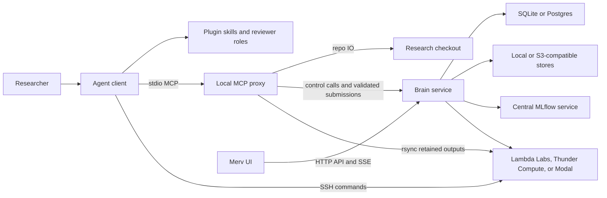

# Merv Architecture

This document describes the architecture implemented by the current codebase.
The executable contracts in `src/merv/brain/research_core/domain/*`, `src/merv/brain/tools/contracts.py`, and
the structural tests under `tests/structure/` are authoritative when prose and
code disagree.

## Product model

Merv gives agentic coding clients a shared, server-directed workflow
for machine-learning research. Its durable model is:

- **Project** — the scope for research state and policy.
- **Claim** — what the project currently believes.
- **Experiment** — a planned, executed, and reviewed test of one or more claims.
- **Resource** — a registered repo file and its observed versions.
- **Review** — an independent judgment pinned to an immutable target snapshot.
- **Reflection** — a reviewed project-wide update to the logic graph, claims,
  and next experiment wave.
- **Sandbox** — an ephemeral SSH-reachable machine used for execution.
- **Storage object** — a durable heavy file kept outside the repo.

Agents do the reasoning and edit ordinary files. The brain owns research state
and decides which mutations and workflow transitions are allowed.

## Runtime topology

There is one topology for both hosted and local deployments:



### Brain service

The brain is the single authority for research records and policy. It owns:

- projects, claims, experiments, resources, reviews, reflections, and events;
- workflow gates, artifact lints, permissions, and reviewer capabilities;
- sandbox registry, provider credentials, quotas, reapers, and cleanup;
- blob metadata, optional heavy-object storage, and MLflow context;
- the `/mcp/*`, `/api/*`, and server-sent-event surfaces.

The brain never receives a checkout root and never opens files from a user's
checkout. Repo-derived facts and size-capped submitted bytes reach it only
through explicit data-plane submissions from the proxy.

`MERV_MODE` selects deployment defaults, not a different component
graph:

| Preset | Brain location | Record/blob defaults | Intended exposure |
|---|---|---|---|
| `local` | `http://127.0.0.1:8787` | SQLite and local-directory blobs | Loopback development; auth off by default |
| `control` | Operator-provided HTTPS URL | Postgres and S3-compatible stores | Supabase-backed end-user auth; TLS and network controls |

The control surface supports optional Supabase-backed end-user authentication
(`SupabaseVerifier` in `services/auth.py`, attached per-request in
`transport/api/app.py`, with device-flow sign-in under `/api/sdk/auth/*` and a
membership gate that 404s foreign projects). It is off by default locally —
booting an unauthenticated hosted surface logs an "OPEN" warning — and
`MERV_REQUIRE_AUTH=1` makes missing auth config a startup failure; the hosted
deployment runs with it required. CORS and the client-version floor are still
not authentication.

### Local MCP proxy

Every client starts `merv-mcp` as a short-lived stdio process. It is
the local data plane in every deployment and owns:

- repo-relative path normalization and containment;
- file observation, hashing, validation, and submitted-byte capture;
- experiment-folder materialization;
- caller public-key submission and use of a caller-supplied private-key path for
  safe rsync pulls; the caller remains the private-key owner;
- safe rsync pulls from sandboxes into the checkout;
- local file uploads/downloads for durable storage;
- feed image and local HTML-embed reads;
- checkout-to-project links in `project_links.sqlite`.

The proxy's startup, JSON-RPC loop, routing, and checked-in tool catalog run on
Python 3.11+ using only the standard library. Data-tool implementations are
loaded lazily when invoked, so listing tools and reaching the hosted brain do not
require a local package installation.

The proxy resolves one brain URL in this order:

1. `MERV_CONTROL_URL`;
2. machine configuration written by `merv-client configure`;
3. `https://experiments.rapidreview.io`.

It resolves project scope from the local checkout link and injects an explicit
`project_id` into project-scoped brain calls. It never forwards `repo_root`.

### Browser UI

`research_state_ui` is a React/Vite supervisory interface, not an agent runtime.
It reads project-scoped HTTP views, uses server-sent events for prompt refreshes,
and falls back to conditional polling with ETags. It renders desktop and mobile
surfaces for claims, experiments, reviews, resources, reflection waves,
sandboxes, MLflow, storage, events, and the research feed.

The browser cannot perform checkout-local operations. Resource registration,
folder creation, local storage transfer, feed-image capture, and sandbox output
pulls must go through the local MCP proxy.

## Composition and persistence

Both deployment presets use the same `ControlApp` composition. The composition
root selects adapters and wires the modular monolith:

- record store: SQLite locally or Postgres when `MERV_DB_URL` is set;
- submitted-byte blob store: local directory or S3-compatible bucket;
- optional heavy-object store: S3-compatible storage;
- sandbox backend: Lambda Labs by default; Thunder Compute, Modal, Hyperstack,
  DigitalOcean, Verda (DataCrunch), Voltage Park, TensorDock, or the fake
  backend used in tests. `RESEARCH_PLUGIN_EXECUTION_BACKENDS` (comma-separated)
  runs several at once behind one multiplexer that routes per-request by
  provider and prefixes sandbox ids with their owner (see
  [SANDBOX_PROVIDERS.md](SANDBOX_PROVIDERS.md));
- MLflow: an explicitly configured centralized tracking service.

Research records live in the brain's selected record store. The only durable
checkout-specific state owned by the proxy is the machine-local project-link
database; research repos contain experiment files, not the brain database.

Core research-record mutations and workflow milestones append project events in
the same transaction as their state change. The UI reads those durable events
for the research timeline. Recent tool-call traffic is a bounded in-memory
diagnostic view and is not part of durable research state.

## Tool routing

The central registry in `src/merv/brain/tools/contracts.py` assigns every tool to one
plane. Control tools run in the brain. These checkout-sensitive tools run in the
proxy and submit validated facts or bytes to the brain:

- `experiment.materialize_folders`;
- `resource.register`;
- `storage.upload_file` and `storage.download_file`;
- `sandbox.request`, `sandbox.attach`, and `sandbox.pull_outputs`;
- `feed.post`.

The merged `project` tool is special:

- `action="current"` reads the local checkout link;
- `action="connect"` validates or creates a brain project, then writes the local
  link;
- `action="overview"` uses the linked project id and reads the brain;
- `action="create"` creates a brain project without linking the checkout.

The brain rejects `repo_root` context and direct calls to data-plane tools. This
keeps the privacy boundary enforceable rather than conventional.

## Workflow architecture

Experiment transitions are declared once in
`src/merv/brain/research_core/domain/workflow_gates.py`:

```text
planned -> design_review -> ready_to_run -> running -> experiment_review -> complete
```

`failed` and `abandoned` are terminal exits. A result-review rejection returns
to `running` when the plan still stands, or to `planned` with a new attempt when
the design is flawed.

The same gate table drives:

- enforcement in `ExperimentService`;
- next-action guidance in `WorkflowService`;
- transition discovery and gate checklists returned to agents and the UI.

Reflection transitions are declared in
`src/merv/brain/research_core/domain/reflection_gates.py`:

```text
reflecting -> synthesizing -> reflection_review -> published
```

Rejections return to `synthesizing` when the five lens documents still stand
or to `reflecting` when the fan-out must be repeated.

All meaning-changing actions use typed MCP or HTTP operations. Editing a local
file does not mutate research state. A file becomes evidence only after
`resource.register` observes it and, when requested, associates the submitted
version with a target and role.

## Evidence and storage

Three storage layers have distinct purposes:

1. **Repo files** hold source, plans, compact results, reports, figures, and
   logic graphs. The proxy registers them as resources.
2. **Submitted-byte blobs** pin size-capped gated artifacts and selected small
   metric JSON so lints and reviewers see immutable submissions rather than a
   later working-tree edit.
3. **Heavy-object storage** keeps large datasets, checkpoints, archives, and
   other valuable files that should not live in git.

MLflow is the quantitative run ledger. Plugin state stores the research meaning
around those runs: claim links, reviewed conclusions, resource references, and
workflow state.

Nothing on a sandbox is durable by default. Before release or expiry, agents
must pull compact evidence into the repo or upload heavy files to durable
storage.

## Reviewer boundary

Reviews use request-scoped capabilities rather than prompt trust:

1. The producer calls `review.request`.
2. The brain pins the target snapshot, stores only a hash of the capability, and
   returns the plaintext capability once with a reviewer handoff prompt.
3. A separate reviewer is expected to call `review.start` with a required
   caller-supplied session string different from the producer-supplied string.
4. `review.start` returns current-attempt gated artifacts plus any system
   exhibit; the reviewer skill imposes a procedural read-only role whose only
   intended state-changing call is `review.submit`.
5. Request creation validates a workflow role against the active gate. Start
   rejects invalid/expired/superseded capabilities, equal declared session
   strings, or stale snapshots. Submit rechecks that the request is open and
   the snapshot is current, and only the first valid submission is accepted.

The dispatcher also rejects other mutations that explicitly carry a
`review_session_id`, but it does not authenticate every read or unrelated tool
call as that reviewer. This is a practical workflow boundary, not cryptographic
proof that two separate models reasoned independently.

## Code boundaries

The brain is a modular monolith with kernel, research-core, artifacts,
object-storage, sandbox, feed, MLflow, and surface modules. The exact file
classification and allowed dependency edges live in
`tests/structure/test_module_boundaries.py`; the test currently permits no
grandfathered violations.

Additional structure tests enforce:

- complete and disjoint control/data tool assignments;
- no checkout/process dependencies in brain-owned policy modules;
- provider-neutral sandbox services;
- a standard-library-only MCP proxy;
- parity between live tool contracts and the checked-in proxy catalog.

See [MODULE_BOUNDARIES.md](MODULE_BOUNDARIES.md) for the import law and
[CONTROL_DATA_PLANE_SPLIT.md](CONTROL_DATA_PLANE_SPLIT.md) for the detailed
ownership table.
