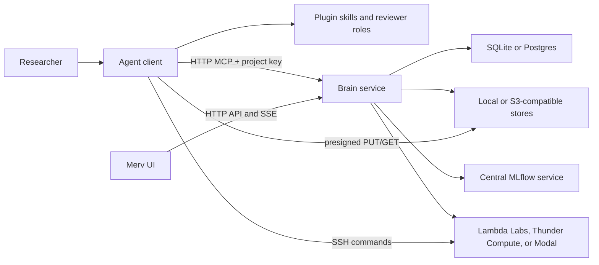

# Merv Architecture

This document describes the architecture implemented by the current codebase.
The executable contracts in `src/merv/brain/research_core/domain/*`, `src/merv/brain/surface/tools/contracts.py`, and
the structural tests under `tests/structure/` are authoritative when prose and
code disagree.

## Product model

Merv gives agentic coding clients a shared, server-directed workflow
for machine-learning research. Its durable model is:

- **Project** — the scope for research state and policy.
- **Claim** — what the project currently believes.
- **Experiment** — a planned, executed, and reviewed test of one or more claims.
- **Artifact** — a typed document submitted against a workflow target.
- **Review** — an independent judgment pinned to an immutable target snapshot.
- **Reflection** — a reviewed project-wide update to the logic graph, claims,
  and next experiment wave.
- **Sandbox** — an ephemeral SSH-reachable machine used for execution.
- **Storage object** — a durable heavy file kept outside the repo.

Agents do the reasoning and edit ordinary files. The brain owns research state
and decides which mutations and workflow transitions are allowed.

## Runtime topology

There is one topology for both hosted and local deployments:



### Brain service

The brain is the single authority for research records and policy. It owns:

- projects, claims, experiments, artifacts, reviews, reflections, and events;
- workflow gates, artifact lints, permissions, and reviewer capabilities;
- sandbox registry, provider credentials, quotas, reapers, and cleanup;
- blob metadata, optional heavy-object storage, and MLflow context;
- the `/mcp/*`, `/api/*`, and server-sent-event surfaces.

The brain never receives a checkout root and never opens files from a user's
checkout. Agents submit typed artifacts and other bytes by calling a tool that
mints a presigned upload and running the returned command; the bytes travel
directly to object storage over that URL, never through the brain.

`MERV_MODE` selects deployment defaults, not a different component
graph:

| Preset | Brain location | Record/blob defaults | Intended exposure |
|---|---|---|---|
| `local` | `http://127.0.0.1:8787` | SQLite and local-directory blobs | Loopback development; auth off by default |
| `control` | Operator-provided HTTPS URL | Postgres and S3-compatible stores | Supabase-backed end-user auth; TLS and network controls |

The control surface supports optional Supabase-backed end-user authentication
(`SupabaseVerifier` in `services/auth.py`, attached per-request in
`transport/api/app.py`, with device-flow sign-in under `/api/sdk/auth/*` and a
membership gate that 404s foreign projects). It is off by default locally —
booting an unauthenticated hosted surface logs an "OPEN" warning — and
`MERV_REQUIRE_AUTH=1` makes missing auth config a startup failure; the hosted
deployment runs with it required. CORS and the client-version floor are still
not authentication.

### Agent client connection

Every client connects directly to the brain's `/mcp` endpoint over HTTP,
authenticated by a project-scoped key (`Authorization: Bearer <key>`). The
committed `.mcp.json` uses `type:"http"` and reads the key from the
`MERV_MCP_KEY` environment variable — the key is never inlined, because it is
bearer-equivalent to full access to its one bound project. There is no local
proxy and no local data plane: one wire protocol serves a local agent, a cloud
agent, and a browser-driven agent identically.

The key binds one immutable project. The gateway injects that project into
project-scoped calls, so agents never pass `repo_root` and the brain never
receives a checkout root. Bytes that must move — artifact and storage uploads,
sandbox output pulls, feed images — travel agent-side over presigned URLs: the
tool returns a one-line command the agent runs, and the bytes stream directly
to or from the object store or sandbox, never through the brain or the agent's
model context.

Pure two-sided contracts live in `merv.shared`: error identities, path naming,
narrow tool-shape validation, storage transfer/guidance, feed-media primitives,
artifact roles, and markdown-image parsing. Workflow policy, Pydantic models,
service composition, and mutation authority remain brain-owned.

The connection URL lives in `.mcp.json` (default
`https://experiments.rapidreview.io/mcp`); self-hosted deployments regenerate
the snippet with `merv-client env` pointed at their own brain.

### Browser UI

`research_state_ui` is a React/Vite supervisory interface, not an agent runtime.
It reads project-scoped HTTP views, uses server-sent events for prompt refreshes,
and falls back to conditional polling with ETags. It renders desktop and mobile
surfaces for claims, experiments, reviews, artifacts, reflection waves,
sandboxes, MLflow, storage, events, and the research feed.

The browser cannot perform checkout-local operations. Local storage transfer,
feed-image capture, and sandbox output pulls are agent-driven through typed
tools and the upload/download commands they return, as is artifact submission
(artifact.submit plus the returned upload command).

## Composition and persistence

Both deployment presets use the same `ControlApp` composition. The composition
root selects adapters and wires the modular monolith:

- record store: SQLite locally or Postgres when `MERV_DB_URL` is set;
- submitted-byte blob store: local directory or S3-compatible bucket;
- optional heavy-object store: S3-compatible storage;
- sandbox backend: Lambda Labs by default; Thunder Compute, Modal, Hyperstack,
  DigitalOcean, Verda (DataCrunch), Voltage Park, TensorDock, or the fake
  backend used in tests. `RESEARCH_PLUGIN_EXECUTION_BACKENDS` (comma-separated)
  runs several at once behind one multiplexer that routes per-request by
  provider and prefixes sandbox ids with their owner (see
  [SANDBOX_PROVIDERS.md](SANDBOX_PROVIDERS.md)). A lazy driver registry is the
  runtime provider inventory: composition resolves one descriptor per selected
  name and imports only its factory. VM drivers share a management-SSH base;
  Modal remains a separate managed-container/provider-exec driver;
- MLflow: an explicitly configured centralized tracking service.

Research records live in the brain's selected record store. There is no durable
checkout-local state: a project is bound by its key, not by a machine-local link
database; research repos contain experiment files, not the brain database.

Core research-record mutations and workflow milestones append project events in
the same transaction as their state change. The UI reads those durable events
for the research timeline. Recent tool-call traffic is a bounded in-memory
diagnostic view and is not part of durable research state.

Application workflows can synchronously react to an exact committed event
through a composition-owned registry. Transition tracking, canonical tracking
finalization guidance, and terminal Feed guidance use this path.
Producer-facing review guidance correlates `review.status` with the existing
`review.submitted` event; it does not append a second event. Fatal and advisory
registrations are explicit, and there is no background event worker or delivery
checkpoint yet.

## Tool routing

The brain registry in `src/merv/brain/surface/tools/contracts.py` is the single
generator and source of truth for tool schemas and plane assignments. Since the
no-dataplane transition every tool is a control tool that runs in the brain.
Byte transfers (`storage.submit`, `storage.fetch`, `artifact.submit`,
`feed.post`) hand back a one-line command the agent runs to move bytes over a
presigned URL, and sandbox provisioning (`sandbox.request`, `sandbox.attach`,
`sandbox.pull_outputs`) is served by the brain. No tool moves checkout bytes
through the brain.

The merged `project` tool is special:

- `action="current"` returns the project bound to the caller's key;
- `action="connect"` does not apply to a keyed agent — the key already binds one
  immutable project;
- `action="overview"` reads the brain for the bound (or explicitly given) project;
- `action="create"` creates a brain project.

`merv.shared` holds only pure two-sided contracts and imports no brain
internals, so the privacy boundary stays enforceable rather than conventional.

## Workflow architecture

Experiment transitions are declared once in
`src/merv/brain/research_core/domain/workflow_gates.py`:

```text
planned -> design_review -> ready_to_run -> running -> experiment_review -> complete
```

`failed` and `abandoned` are terminal exits. A result-review rejection returns
to `running` when the plan still stands, or to `planned` with a new attempt when
the design is flawed.

The same gate table drives:

- enforcement in `ExperimentService`;
- next-action guidance in the pure `NextActionPolicy`, fed by the
  application-owned `WorkflowQuery`;
- transition discovery and gate checklists returned to agents and the UI.

Reflection transitions are declared in
`src/merv/brain/research_core/domain/reflection_gates.py`:

```text
reflecting -> synthesizing -> reflection_review -> published
```

Rejections return to `synthesizing` when the five lens documents still stand
or to `reflecting` when the fan-out must be repeated.

All meaning-changing actions use typed MCP or HTTP operations. Editing a local
file does not mutate research state. A file becomes evidence only after
`artifact.submit` mints an upload and the agent runs the returned command,
pinning the bytes against a target and role.

## Evidence and storage

Three storage layers have distinct purposes:

1. **Repo files** hold source, plans, compact results, reports, figures, and
   logic graphs. The agent submits the mandated ones as artifacts.
2. **Submitted-byte blobs** pin size-capped gated artifacts and selected small
   metric JSON so lints and reviewers see immutable submissions rather than a
   later working-tree edit.
3. **Heavy-object storage** keeps large datasets, checkpoints, archives, and
   other valuable files that should not live in git.

Artifacts owns artifact identities, upload tokens, figure
membership, and byte retrieval. Research receives those immutable facts through
the public `EvidenceReader` port, then applies experiment/reflection gate and
review policy. Research never queries Artifact tables or reads blobs directly.

MLflow is the quantitative run ledger. Plugin state stores the research meaning
around those runs: claim links, reviewed conclusions, artifact references, and
workflow state.

Nothing on a sandbox is durable by default. Before release or expiry, agents
must pull compact evidence into the repo or upload heavy files to durable
storage.

## Reviewer boundary

Reviews use request-scoped capabilities rather than prompt trust:

1. The producer calls `review.request`.
2. The brain pins the target snapshot, stores only a hash of the capability, and
   returns the plaintext capability once with a reviewer handoff prompt.
3. A separate reviewer is expected to call `review.start` with a required
   caller-supplied session string different from the producer-supplied string.
4. `review.start` returns current-attempt gated artifacts plus any system
   exhibit; the reviewer skill imposes a procedural read-only role whose only
   intended state-changing call is `review.submit`.
5. Request creation validates a workflow role against the active gate. Start
   rejects invalid/expired/superseded capabilities, equal declared session
   strings, or stale snapshots. Submit rechecks that the request is open and
   the snapshot is current, and only the first valid submission is accepted.

The dispatcher also rejects other mutations that explicitly carry a
`review_session_id`, but it does not authenticate every read or unrelated tool
call as that reviewer. This is a practical workflow boundary, not cryptographic
proof that two separate models reasoned independently.

## Code boundaries

The brain is a modular monolith. Research, Artifacts, Sandbox, and Feed are
business components; the Application component coordinates use cases across
their narrow facades. MLflow is an outbound tracking adapter, concrete object
storage is infrastructure, Surface delivers HTTP/MCP, and Kernel is the shared
dependency floor. Every file is classified independently by component
ownership and architectural layer. The exact mappings, import laws, and
shrinking file-pair exception ledger live in
`tests/structure/test_module_boundaries.py`.

Additional structure tests enforce:

- every tool is a control tool servable from the brain;
- no checkout/process/local-IO dependencies in brain-owned policy modules;
- the record store never learns a `repo_root`;
- provider-neutral sandbox services.

See [MODULE_BOUNDARIES.md](MODULE_BOUNDARIES.md) for the import law.
