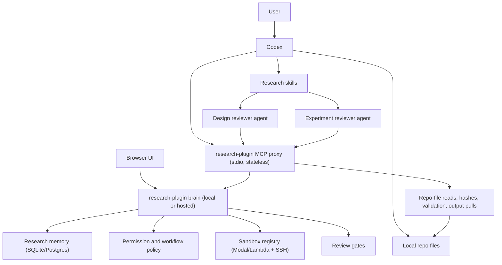

# Research Plugin Architecture

## Purpose

`research_plugin` is a Codex plug-in that replaces the heavy backend with a
small local research kernel exposed through MCP.

The product model remains:

- Claim: what we think
- Experiment: what we try
- Resource: a repo file we use or produce

Everything else exists to help Codex and humans mutate that model correctly.

## Design thesis

The old backend had too many first-class subsystems for the MVP: resource
versions, artifact refs, manifests, workflow persistence, agent telemetry,
operation review, audits, execution, and API read models.

The plug-in architecture keeps the hard boundary but shrinks the implementation:

- Codex performs reasoning, editing, local scripting, and lightweight checks.
- Codex skills define the operating procedure.
- The MCP server owns durable memory and validates mutations.
- The MCP server owns Modal/Lambda sandbox provisioning for ML execution.
- The MCP server tells Codex the current status and next allowed workflow action.
- Design review and full experiment review are separate read-only reviewer roles.
- Reviewers submit structured reviews to MCP; MCP decides whether the gate passes.

## Components



## Process topology

There is one topology:

1. **Brain service** — owns research state, workflow policy, review gates,
   sandbox lifecycle/provisioning, quotas, cleanup, and the `/mcp/*` plus
   `/api/*` surfaces. It never reads a user's checkout. `RESEARCH_PLUGIN_MODE`
   selects a preset, not a different composition path:
   `local` means localhost brain with SQLite, local-dir blobs, no auth, and
   localhost CORS; `control` means hosted brain with durable services.
2. **MCP stdio proxy** — short-lived, spawned by the client. It is the local
   data plane in every deployment: it reads repo files, hashes and validates
   artifacts, materializes experiment folders, pulls retained sandbox outputs
   with rsync, keeps caller SSH key custody, and maps checkout folders to
   projects in `project_links.sqlite`. It dials exactly one brain URL,
   resolved as `RESEARCH_PLUGIN_CONTROL_URL` env var > machine config from
   `research-plugin-client configure` > the hosted default
   `https://experiments.rapidreview.io`; local deployments configure
   `http://127.0.0.1:8787`.

Start the localhost brain before local Codex work. Hosted users do not run a
local brain, but the stdio proxy still runs locally because the brain is never
allowed to see repo bytes or private key material.

The load-bearing rule — *the brain cannot see a user's local filesystem* — puts
file IO and caller key custody on the proxy-local data plane and everything
else (orchestration, records, credentials, authz, cost governance) on the
brain. The module assignment is in **`docs/CONTROL_DATA_PLANE_SPLIT.md`**;
operating the hosted brain is **`docs/CONTROL_PLANE_OPERATIONS.md`**. For client
VM setup, use **`docs/HOSTED_CLIENT_QUICKSTART.md`**.

## Ownership

Codex owns:

- understanding the user's research intent
- reading and editing repo files
- writing scripts and lightweight experiment code
- running local commands when cheap and safe
- asking MCP for project memory, experiment status, and next action
- launching separate reviewer agents when MCP requires design or experiment review
- registering and associating retained local files as resources
- reading MCP-returned resource paths directly from the local repo on later turns

MCP owns:

- project memory for claims, experiments, and resources
- permissioned mutation checks
- experiment state machine and next-action guidance
- Modal/Lambda sandbox provisioning for expensive or long-running ML work
- resource records and version history submitted by the proxy
- resource associations to claims, experiments, reviews, and attempts
- review records and required gates
- reviewer capability tokens and read-only review sessions
- final acceptance/rejection of proposed state changes

## Simplified data model

```text
Project
  Claim[]
  Experiment[]
  Resource[]
  Review[]
  Event[]
```

Claim:

- statement
- scope
- status: draft | active | supported | weakened | contradicted | abandoned
- confidence: low | medium | high
- grounds: links to experiments/resources/reviews

Experiment:

- question or intent
- tested_claim_ids
- status: idea | planned | design_review | ready_to_run | running | experiment_review | complete | failed | abandoned
- plan file resource
- result file resources
- review records
- conclusion proposal
- attempts with prior plans, runs, reviews, and revision context

Resource:

- repo-relative file path
- kind/role
- last observed version token: `path + mtime_ns + size_bytes`
- optional git commit pointer
- associations to experiments, claims, reviews, and attempts

Review:

- target: experiment plan | experiment attempt | claim update
- role: design_reviewer | experiment_reviewer | human | automated-check
- reviewer identity: server-issued review session and capability
- verdict: pass | fail | needs_changes
- notes and required follow-up

Event:

- append-only history of accepted mutations and workflow milestones

## Mutation model

All meaning-changing mutations go through MCP tools.

Codex may edit files locally, but the research state is not changed until MCP
accepts a mutation.

Examples:

- create claim
- create experiment
- link experiment to claim
- register resource file
- mark experiment running
- record sandbox result
- record design review
- record experiment review
- propose claim status change
- accept experiment conclusion

The MCP server should return structured responses:

```json
{
  "ok": true,
  "state_changed": true,
  "requires_review": false,
  "next_action": "launch_experiment_reviewer",
  "message": "Experiment result file registered. Launch experiment review next."
}
```

## Workflow model

The workflow should stay simple but server-directed:

```text
idea -> planned -> design_review -> ready_to_run -> running -> experiment_review -> complete
            ^             |                                  |
            |             v                                  v
            +------ needs_changes                    needs_changes
            |                                                |
            +---------------- planned with revision context --+

failed / abandoned are terminal exits.
```

The server decides which transitions are allowed. Codex first asks the large
orientation question:

```text
workflow.status_and_next(project_id, experiment_id?)
```

In project-local MCP sessions, the stdio proxy supplies `project_id` from the
current repo context, so the agent-facing schema can omit it:

```text
workflow.status_and_next(experiment_id?)
```

The server answers with a project/experiment summary, the current gate, allowed
actions, blocked actions, missing evidence, and the next required step.

Core services never guess the active project. Every project-scoped service call
is explicit; the project-local MCP proxy is the adapter that fills that explicit
scope from repo context.

This tool is deliberately high-level. It can include a known sandbox summary from
durable state, but it should not poll Modal or perform detailed inspection itself.
Codex should use narrower tools when it needs fresh execution details.

Detailed tools exist for deeper inspection:

```text
project.get(project_id)
experiment.get_state(project_id, experiment_id)
sandbox.get(project_id, experiment_id)
sandbox.terminal(project_id, experiment_id)
```

Possible next steps include:

- write experiment plan
- launch design reviewer
- revise plan from design review feedback
- request a sandbox and run the experiment over SSH
- retain outputs and register resources
- launch experiment reviewer
- revise plan from experiment review feedback
- propose claim update
- complete experiment

If experiment review fails, the experiment returns to `planned`, but MCP carries
forward prior run context: previous plan, result resources, failed review
findings, and guidance about what should stay the same versus change.

## Sandbox execution

There is no job abstraction. Codex requests a sandbox and runs commands on it
directly over SSH. A sandbox can be standalone or attached to an experiment; it
can later be attached to another experiment without recreating the VM.

```text
Codex
  -> sandbox.request (MCP)
      -> SandboxService registry  (project sandbox, optional experiment attachment)
          -> SandboxBackend (Modal/Lambda)  ->  sandbox/VM + SSH endpoint
  -> ssh <command>  (run by Codex itself, recorded to the experiment transcript)
  -> explicit copy/upload of retained outputs before release
```

MCP owns policy, state, and visibility:

- gate `sandbox.request` on experiment status (`ready_to_run` / `running`)
- own per-sandbox SSH facts and the durable `sandboxes` row
- procure / reuse / release sandboxes and reconcile liveness
- expose the terminal transcript for visibility
- tell Codex when output files should be retained and registered as resources

`execution` owns the `SandboxBackend` implementations. The default backend is
**Lambda Labs** (VM-backed GPU execution); Thunder Compute and Modal are also
supported; `fake` is used for tests. Backends only procure SSH-reachable
machines and expose lifecycle/observability hooks. Backends declare a
`requires_hardware_selection` capability and may expose an optional
`hardware_catalog()`: Thunder and Lambda bundle GPU+CPU+RAM into fixed instance
types, so `SandboxService` returns a live availability menu (`needs_selection`)
when `sandbox.request` omits the `instance_type`; Modal composes the machine from
`gpu`/`cpu`/`memory` and needs no selection step.

## Reviewer identity and independence

Local reviewer identity cannot rely on IP addresses or machine boundaries. The
MVP should model identity as server-issued workflow capability:

1. Main Codex asks MCP for a review request.
2. MCP creates `review_request_id` and a one-time `reviewer_capability`.
3. The capability is scoped to one target, one role, read-only inspection tools,
   and `review.submit` for that request.
4. Main Codex spawns a separate reviewer agent with the appropriate review skill
   and passes the capability plus target context.
5. The reviewer starts a review session with MCP and submits the review directly.
6. MCP rejects reviews from the same producer session, expired capabilities,
   wrong role, wrong target, or capabilities minted before the target snapshot.

This is not cryptographic proof that two independent local minds were involved.
It is the practical local boundary: separate review assignment, separate tool
scope, immutable target snapshot, session lineage, and audit trail. For stronger
assurance, MCP can mark a review as `unverified_agent_review` and require human
review for high-risk gates.

## Plugin skills

The primary skill should make Codex follow the research loop:

1. inspect memory through MCP
2. clarify claim or experiment intent
3. create or update experiment plan through MCP
4. edit local files as needed
5. run lightweight checks locally
6. request a sandbox from MCP and run long work on it over SSH
7. retain outputs and register/associate local files as resources
8. launch design or experiment reviewer agent when MCP requires it
9. ensure the reviewer submits review directly to MCP
10. propose claim/experiment updates through MCP
11. ask MCP for next action until terminal

The review skills should make reviewer agents adversarial but bounded:

- design review checks whether the planned experiment can test the claim
- experiment review checks implementation, outputs, metrics, and conclusion
- both inspect only via read-only context/tools
- return a structured verdict
- submit the review to MCP
- never mutate project state directly

## MVP exclusions

Do not include in v0.1:

- artifact object store
- content-addressed manifests
- generic backend REST API
- browser UI
- multi-project server
- OAuth
- complex RBAC
- Temporal-style workflow engine
- broad automatic claim rewriting
- directory resources
